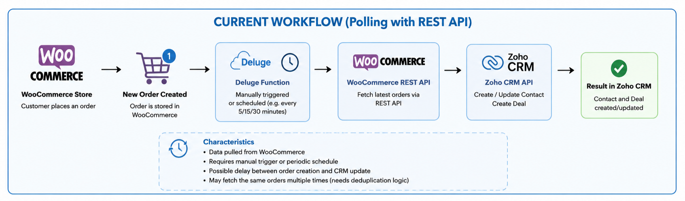
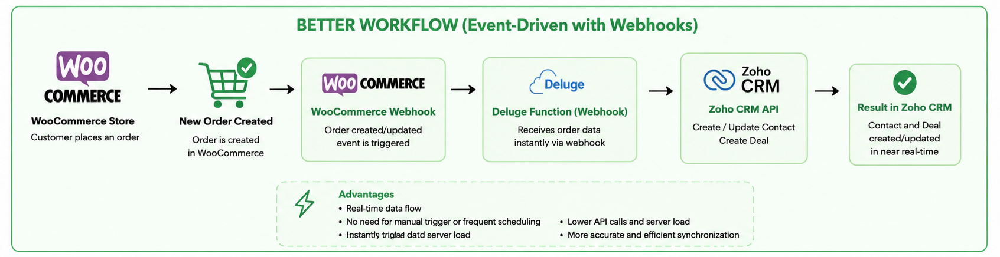
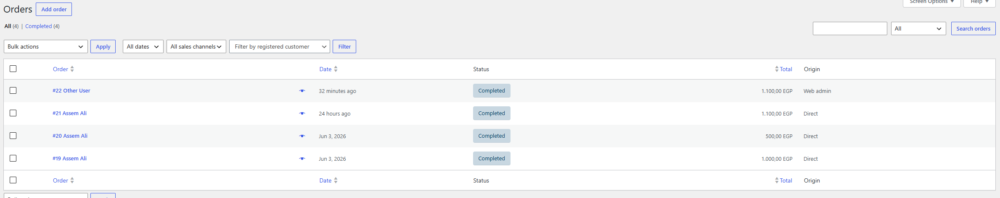
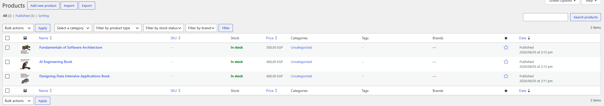

# WooCommerce → Zoho CRM Integration

Automatically synchronizes WooCommerce orders into Zoho CRM Contacts and Deals using Zoho Deluge scripts and the WooCommerce REST API.

---

## Table of Contents

1. [Overview](#overview)
2. [Architecture](#architecture)
3. [Setup](#setup)
4. [OAuth Configuration](#oauth-configuration)
5. [Running the Integration](#running-the-integration)
6. [Data Mapping](#data-mapping)
7. [Screenshots](#screenshots)
8. [Challenges & Design Decisions/Assumptions](#assumptions--design-decisions)
9. [Future Improvements](#future-improvements)

---

## Overview

This integration polls the WooCommerce REST API for completed orders that were created or modified after the last sync, then creates or updates the corresponding Contacts and Deals inside Zoho CRM. It is designed to run on a schedule via a Zoho CRM Scheduler.

**Key behaviors:**

- Only `completed` orders are synced — no Deals are created for unpaid or pending orders.
- A `last_sync_timestamp` CRM variable is maintained and updated after every successful run, so each execution only fetches new or recently modified orders.
- Contacts are deduplicated by email — existing contacts are updated if their data changed, and new contacts are created otherwise.
- Deals are deduplicated by name (`WC Order #<id> - <name>`) so re-running the scheduler never creates duplicate records.

---

## Architecture

### Current Implementation

The integration uses a **polling** model: a Zoho Scheduler fires on a schedule and calls the WooCommerce REST API directly from a Deluge function.

```
Zoho Scheduler
     │
     ▼
sync_wc_orders()
     │
     ├── get_wc_orders()  ──► WooCommerce REST API  (/wp-json/wc/v3/orders)
     │         │
     │         └── update_crm_variable()  ──► Zoho CRM Variables (last_sync_timestamp)
     │
     └── for each order:
              ├── get_customer_data()
              ├── create_contact()  ──► Zoho CRM Contacts
              └── create_deal()     ──► Zoho CRM Deals
```

**Current dataflow:**



---

### Goal Architecture (Webhook-Driven)

What I would do in a production system is replace the polling scheduler with **WooCommerce Webhooks** as the integration trigger. Instead of Zoho pulling orders on a schedule, WooCommerce would push each order event to an endpoint the moment it is created or updated.



This eliminates the need for the `last_sync_timestamp` variable, reduces API calls to zero during quiet periods, and achieves near real-time synchronization. The current implementation follows the polling architecture as required by the assessment while remaining fully compatible with a future webhook-based replacement.

---

## Challenges & Design Decisions/Assumptions

**Only completed orders are synced.**
This avoids creating Deals in Zoho for orders that have not been fulfilled. Cancelled, pending, and processing orders are excluded.

**`modified_after` instead of `after` or order ID tracking.**
Three approaches were considered for incremental sync:

1. Track `last_processed_order_id` and only fetch orders with a higher ID — simple, but misses updates to older orders.
2. Track `last_sync_timestamp` and use `?after=` — fetches new orders but also misses updates.
3. Track `last_sync_timestamp` and use `?modified_after=` — fetches both new orders and any orders modified since the last run.

Option 3 was chosen. It is documented in the [WooCommerce REST API reference](https://developer.woocommerce.com/docs/apis/rest-api/v3/orders/).

**Standalone functions must return strings.**
Zoho CRM standalone functions are required to return a `string`. Data structures are serialized with `.toString()` on return and deserialized with `.toMap()` / `.toList()` at the call site.

**ngrok for local development.**
Zoho's servers cannot reach `localhost`, so ngrok was used to expose the local WordPress installation via a public URL. In production this would be replaced by the actual site domain.

---


## Setup

### Prerequisites

- A running WordPress + WooCommerce site (local or hosted)
- A Zoho CRM account with Deluge scripting access
- [ngrok](https://ngrok.com/) (if running WooCommerce locally — Zoho cannot reach `localhost`)

### 1. Expose WooCommerce Locally (if needed)

```bash
ngrok http {WordPress port or URL}
```

Copy the generated public URL (e.g. `https://abc123.ngrok.io`) — this is your `wp_base_url`.

### 2. Configure Zoho CRM Variables

Create the following variables under **Zoho CRM → Setup → Developer Space → Variables**:

| Variable Name         | Type   | Example Value                          |
|-----------------------|--------|----------------------------------------|
| `wp_base_url`         | String | `https://abc123.ngrok.io/`             |
| `wc_rest_api`         | String | `wp-json/wc/v3/`                       |
| `wc_consumer_key`     | String | `ck_xxxxxxxxxxxxxxxxxxxx`              |
| `wc_consumer_secret`  | String | `cs_xxxxxxxxxxxxxxxxxxxx`              |
| `last_sync_timestamp` | String | `2000-01-01T00:00:00`                  |

> The default value `2000-01-01T00:00:00` for `last_sync_timestamp` ensures the first run fetches all historical completed orders.

### 3. Create the Zoho CRM Connection

Create a connection named `crm_connection` under **Setup → Developer Space → Connections** with the following scopes:

```
ZohoCRM.modules.contacts.ALL
ZohoCRM.modules.deals.ALL
ZohoCRM.settings.variables.ALL
```

### 4. Add the Deluge Functions

Add each file from `deluge/functions/` as a standalone Zoho CRM function. The call order is managed internally — you only need to trigger `sync_wc_orders`.

### 5. Add the Scheduler

Add `deluge/Schedulers/sync_contacts_deals_orders.ds` as a Zoho CRM Scheduler and set your desired interval.

---

## OAuth Configuration

The integration uses a **Self Client** OAuth application in Zoho.

**Required scopes:**

```
ZohoCRM.modules.leads.ALL
ZohoCRM.modules.contacts.ALL
ZohoCRM.modules.deals.ALL
ZohoCRM.settings.variables.ALL
```

To generate the authorization URL manually:

```
https://accounts.zoho.com/oauth/v2/auth
  ?scope=ZohoCRM.modules.contacts.ALL,ZohoCRM.modules.deals.ALL,ZohoCRM.settings.variables.ALL
  &client_id=YOUR_CLIENT_ID
  &response_type=code
  &access_type=offline
  &redirect_uri=https://deluge.zoho.com/delugeauth/callback
  &prompt=consent
```

> Use `access_type=offline` to receive a refresh token so the connection stays alive without manual re-authentication.

---

## Running the Integration

**Manually (for testing):**

Open the `sync_wc_orders` function in the Deluge editor and click **Execute**. Check the logs for the sync result and any per-order errors.

**Automatically:**

The scheduler `sync_contacts_deals_orders` calls `sync_wc_orders()` on your configured interval. It logs the result via `info`.

---

## Data Mapping

### WooCommerce Order → Zoho Contact

| WooCommerce Field       | Zoho CRM Contact Field |
|-------------------------|------------------------|
| `billing.first_name`    | `First_Name`           |
| `billing.last_name`     | `Last_Name`            |
| `billing.email`         | `Email`                |
| `billing.phone`         | `Phone`                |

### WooCommerce Order → Zoho Deal

| WooCommerce Field                  | Zoho CRM Deal Field | Notes                                    |
|------------------------------------|---------------------|------------------------------------------|
| `id`                               | `Deal_Name`         | Formatted as `WC Order #<id> - <name>`  |
| `total`                            | `Amount`            |                                          |
| `billing.first_name/last_name`     | `Contact_Name`      | Linked to the created/updated Contact    |
| `line_items[].name` (concatenated) | `Description`       | Comma-separated product names            |

All synced Deals are created with `Stage = "Closed Won"` since only completed WooCommerce orders are processed.

---

## Screenshots

### Zoho CRM Setup

**CRM Connection**


**OAuth2 Client**


**CRM Connections Overview**


**CRM Variables**


**Deployed Functions**


**Scheduler**


**Contacts After Sync**


**Deals After Sync**


---

### WooCommerce

**Orders in WooCommerce**



**Products in WooCommerce**




---

## Future Improvements

- **Webhook-driven sync** — Replace the scheduler with WooCommerce Webhooks so orders trigger the integration immediately on creation or update, eliminating polling latency and unnecessary API calls during quiet periods.
- **Retry mechanism** — Failed order syncs currently log an error and move on. A retry queue (or Zoho scheduled retry) would improve reliability.
- **Dead-letter queue** — Orders that fail repeatedly should be stored for manual review rather than silently dropped.
- **Richer contact deduplication** — Currently deduplication is email-only. A production system might also match on phone number or name to handle guests who provide different emails across orders.
- **Order status synchronization** — Update the Deal `Stage` in Zoho if the WooCommerce order status changes (e.g. refunded → update Deal to `Closed Lost`).
- **Pagination observability** — Log the total order count and number of pages fetched per run for easier debugging.
- **Environment-based configuration** — Move WooCommerce credentials out of CRM Variables and into a proper secrets manager for production deployments.